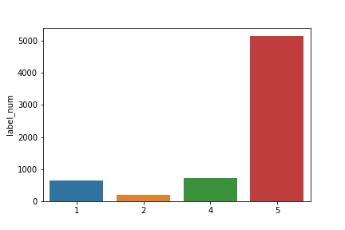
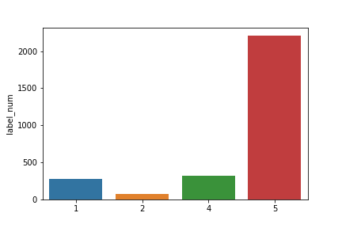
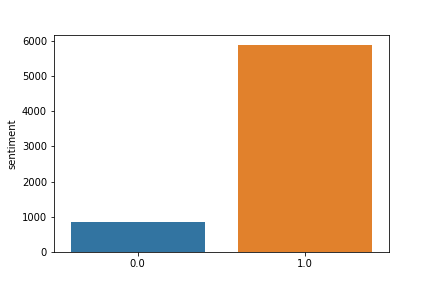
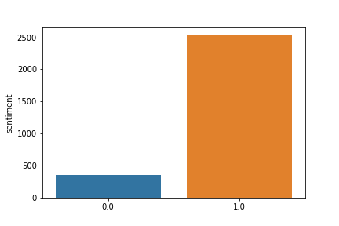

## Google Play Review

Doing a sentimient anlaysis for one of indonesian app on google play store

The dataset can be downloaded [here](https://drive.google.com/open?id=15ijuoBID32J2Sp3IFM1XRcrYRbOxB6DC)

Train label distribution|Test label distribution
---|---
 | 

Train sentiment distribution | Test sentiment distribution
---|---
 |

The objective of the dataset is to predict given review contains negative sentiment or not.
There are 5 steps to get the result:

1. Data wrangling
    - in this experiment, we exclude reviews that has 3 star. We group reviews that has 1 or 2 star as negative, and 4 or 5 star as positive.

2. Cleansing
    - first, we tokenize the text into word
    - second, we filter out the word that has length of word more than 2
    - third, we remove punctuation
    - no stopword is used in this experiment

3. Feature extraction
    - In this step, we use CountVectorizer with default parameters by scikit-learn

4. Model
    - We use Multinomial Naive Bayes with alpha = 1.0 fit_prior=True, class_prior=None

5. Evaluation
    - We evaluate the model by using f1 score, recall, and precision. We do not use accuracy metrics in this dataset. Because the data suffer from imbalance problem.

At the end of the experiment, we are freaking out with the result.
We got:
- f1 score  : 96% 
- precision : 96%
- recall    : 95%

Thank you for reading